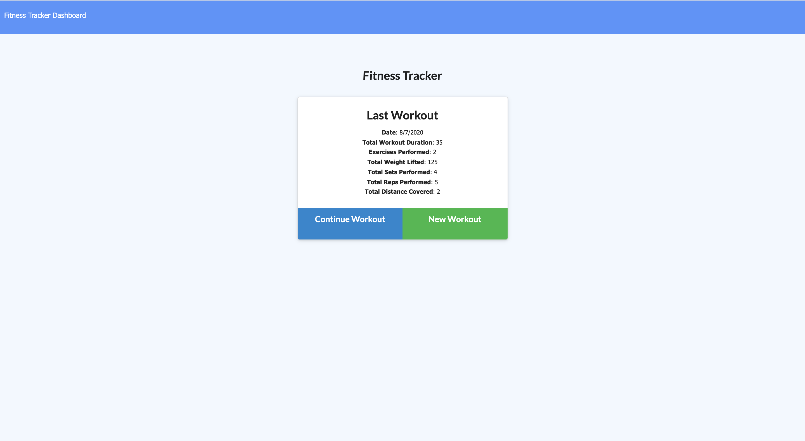
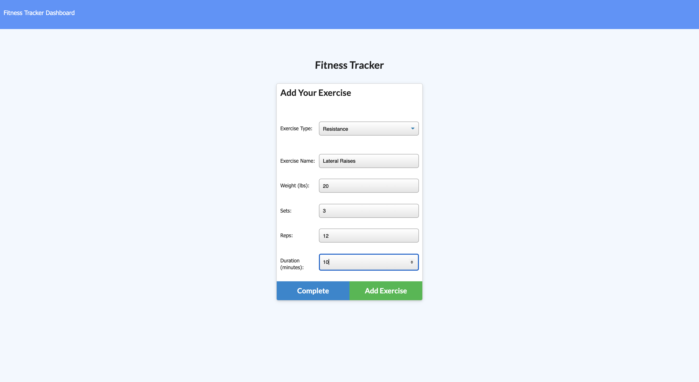
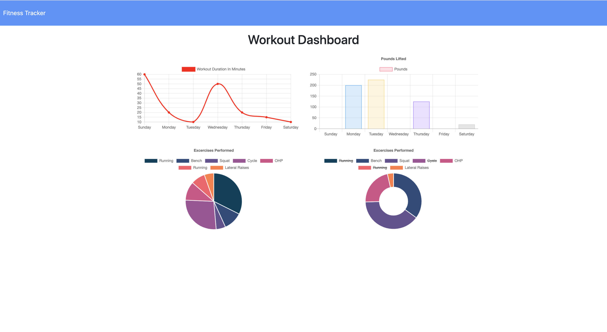

# FitnessTracker

In the fitness community, you would be hard-pressed to find someone who does not track their progress. Whether you are amongs power lifters, runners, yogis, or body builders, keeping track of the numbers while you workout is a tried and true method for achieving your goals. This application allows people to track their workouts by entering them into a database. Users can add as many exercises to a workout as they would like, and create new workouts each day. Users can then see their exercise information displayed graphically for an informative view into their progress.

This application uses an express server to listen for client-side endpoint requests. It then serves or stores the client's workout information using the mongoose ODM (object document mapper) which queries a noSQL databse.

## Contents

* [Installing](#installing)
* [Built With](#built-with)
* [Application Functionality](#application-functionality)
* [Deployed Application](https://secure-depths-32676.herokuapp.com/)
* [Developer Information](#gabriel-sucich)

## Installing

To access code for use or development, clone the Github repository onto your local machine using:

```
git clone https://github.com/GabeSucich/FitnessTracker.git
```

To download the necessary dependencies, navigate into the cloned directory and enter the following in terminal:

```
npm install
```

## Built With

* [HTML](https://developer.mozilla.org/en-US/docs/Web/HTML)
* [Javascript](https://developer.mozilla.org/en-US/docs/Web/JavaScript)
* [Chart js](https://www.chartjs.org/)
* [mongoDB]https://www.mongodb.com/)
* [mongoose](https://www.npmjs.com/package/mongoose)
* [express](https://www.npmjs.com/package/express)

## Application Functionality

The user is prompted to either create a new workout, or add to their existing workout.



***

The user is then prompted to enter information about the new exercise in their workout.



***

On the stats page, the user can see a graphical depiction of their progress over the previous week.



#### See the [deployed link](https://calm-crag-14292.herokuapp.com/?id=5f2e3c367825e8001726f3b6) here

### Gabriel Sucich


- [Portfolio](https://gabesucich.github.io/Portfolio2/)
- [Github](https://github.com/GabeSucich)
- [LinkedIn](www.linkedin.com/in/gabriel-sucich-6a28a71a8)

See also the list of any other [contributors](https://github.com/GabeSucich/FitnessTracker/contributors) who on this project.


